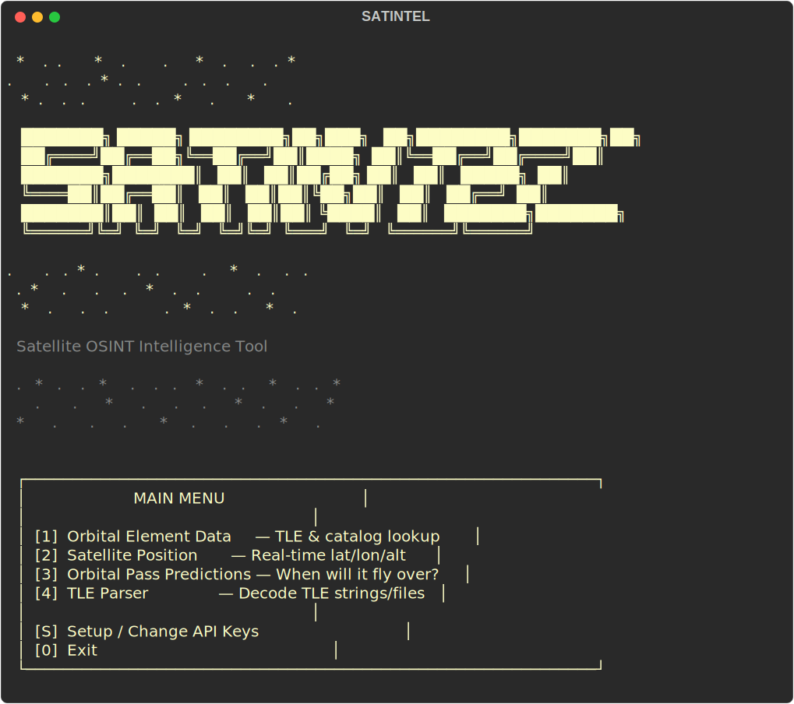
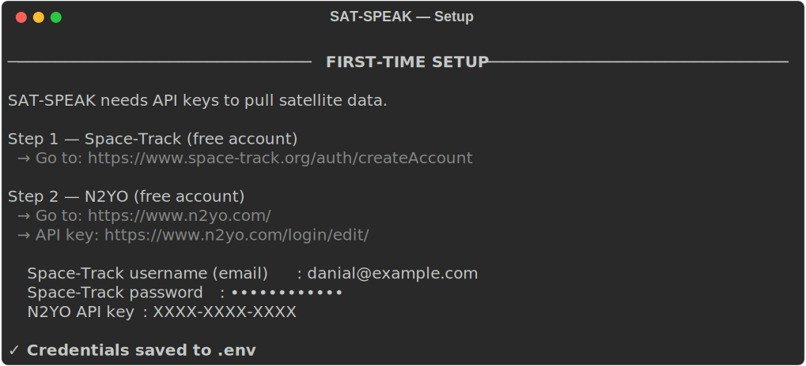
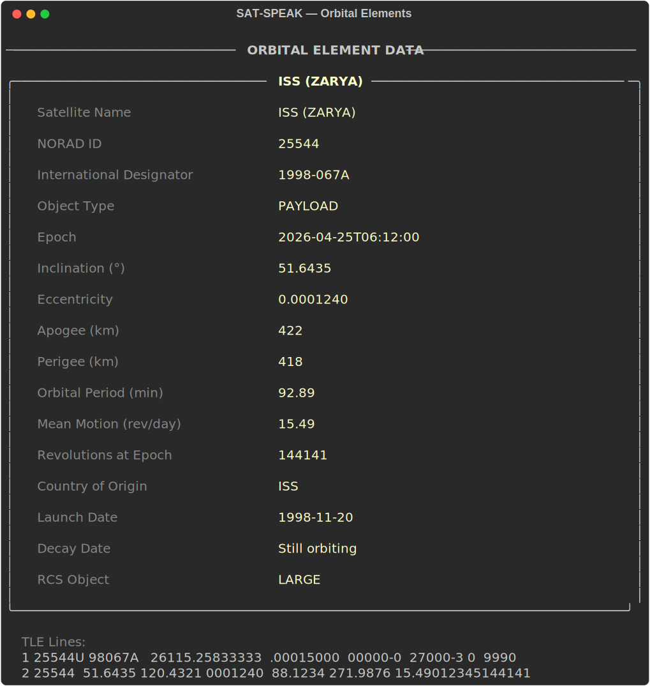
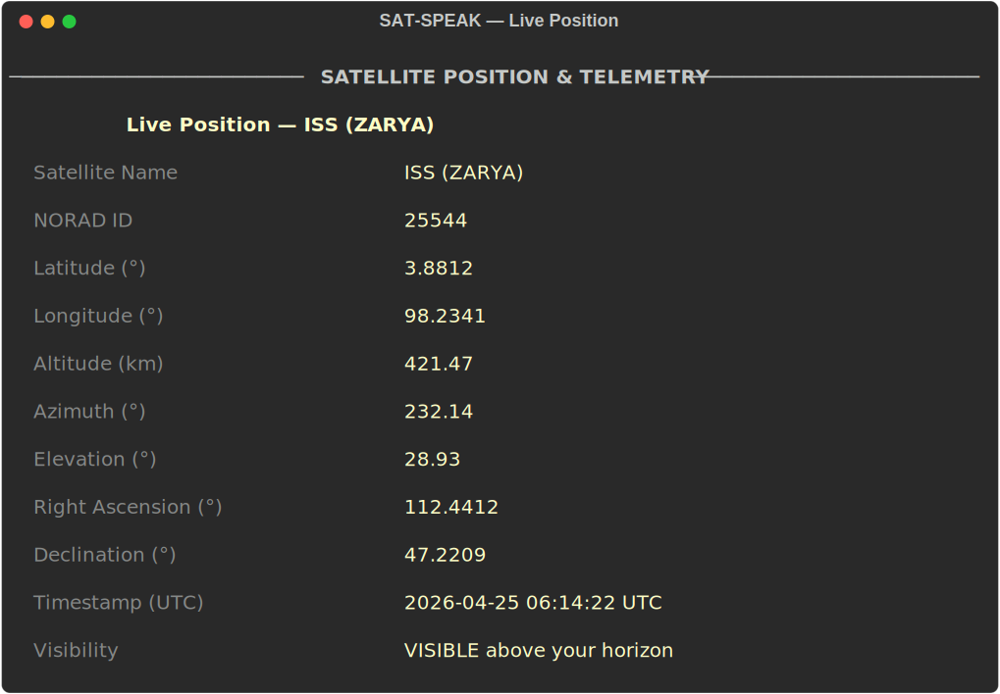
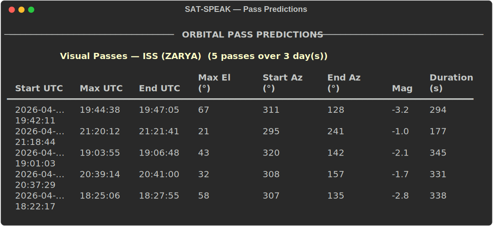
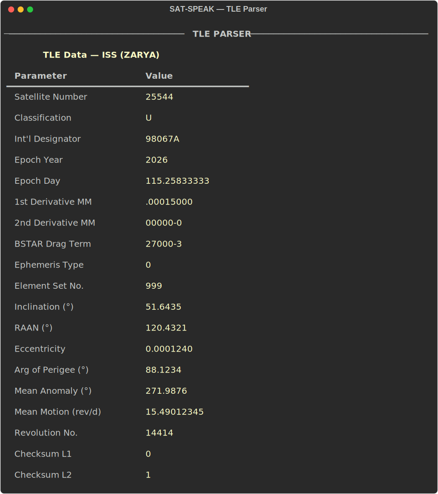

# SATINTEL

**Satellite OSINT Intelligence Tool** — track any satellite from your terminal.

No coding experience needed. Just run two commands and you're in.



---

## What it does

| Feature | Description |
|---|---|
| **Orbital Elements** | Look up any satellite's TLE data and orbital stats from Space-Track |
| **Live Position** | See a satellite's real-time latitude, longitude, altitude and visibility |
| **Pass Predictions** | Find out exactly when a satellite will fly over your location |
| **TLE Parser** | Decode raw TLE strings or files into plain readable data |

---

## Screenshots

### Setup Wizard
First time? SATINTEL walks you through getting your free API keys step-by-step.



### Orbital Element Data
Look up any satellite by NORAD ID and see its full orbital profile.



### Live Satellite Position
Real-time position, altitude, azimuth and visibility from your location.



### Pass Predictions
Know exactly when to look up — date, time, max elevation, direction.



### TLE Parser
Paste or load TLE data and get every orbital parameter decoded.



---

## Requirements

- **Python 3.8 or newer** — [Download here](https://www.python.org/downloads/)
- A free [Space-Track](https://www.space-track.org/auth/createAccount) account
- A free [N2YO](https://www.n2yo.com/login/register.php) account + API key

Everything else installs automatically.

---

## Install & Run

**Step 1 — Clone the repo**
```bash
git clone https://github.com/danialrobieiwong/SATINTEL
cd SATINTEL
```

**Step 2 — Run setup (first time only)**
```bash
./setup.sh
```

**Step 3 — Launch**
```bash
./run.sh
```

On first launch, SATINTEL will ask for your API keys and save them. You won't need to enter them again.

---

## Getting your API keys

### Space-Track (free)
1. Register at [space-track.org/auth/createAccount](https://www.space-track.org/auth/createAccount)
2. Your username is your email and the password you set

### N2YO (free)
1. Register at [n2yo.com/login/register.php](https://www.n2yo.com/login/register.php)
2. After logging in, go to [n2yo.com/login](https://www.n2yo.com/login/) to find your API key

---

## Useful NORAD IDs to try

| Satellite | NORAD ID |
|---|---|
| International Space Station | 25544 |
| Hubble Space Telescope | 20580 |
| James Webb Space Telescope | 50463 |
| Tiangong Space Station | 48274 |

Find more at [celestrak.org](https://celestrak.org/SOCRATES/)

---

## Troubleshooting

**`python3: command not found`**
Install Python from [python.org/downloads](https://www.python.org/downloads/)

**`Permission denied: ./setup.sh`**
```bash
chmod +x setup.sh run.sh
./setup.sh
```

**Space-Track login failed**
Double-check your email and password at [space-track.org](https://www.space-track.org)

**N2YO returns no data**
Make sure your API key is correct — find it on your N2YO account page after logging in
